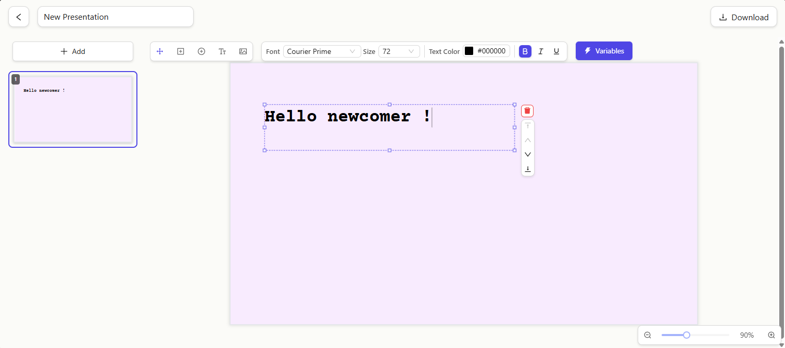
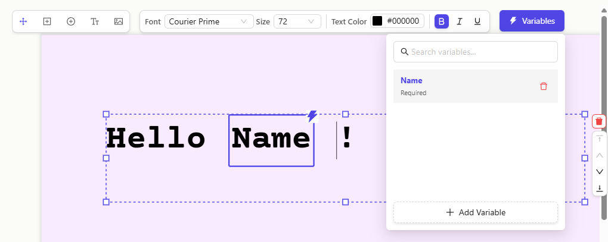
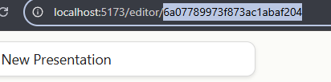
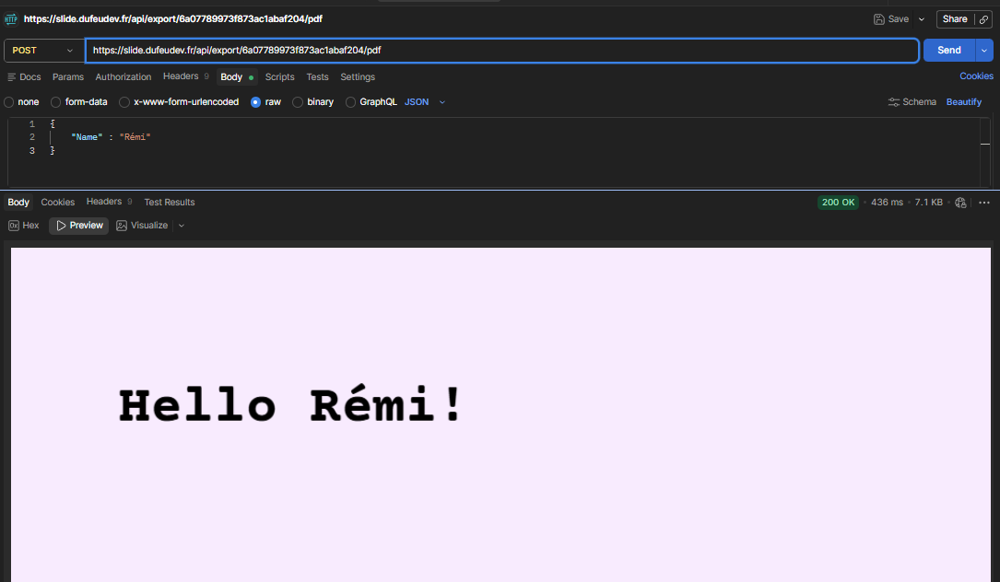
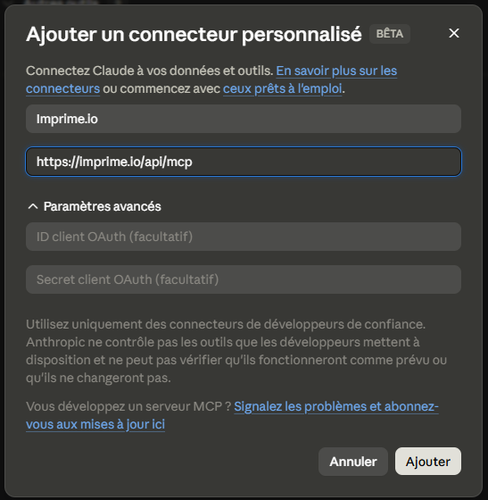

# What is this project

> Demo: [https://imprime.io/](https://imprime.io/)

Imprime is a tool that speeds up document generation. It allows you to design templates in a visual editor by placing placeholders within them, and then generate the final documents either via the download button or via an API.

Designed primarily for developers, Imprime integrates as a dedicated component within your architecture, to which you can fully delegate the templating and document generation processes.

# Why Imprime

This project arose from a developer’s frustration: generating documents programmatically remains a tedious task, one that is poorly supported by existing tools such as DOCX markup or HTML templates.

# Can i use Imprime

The Apache 2.0 licence legally gives you the right to do pretty much anything you like with Imprime — including redistributing it commercially. We simply ask, in all friendship, that you do not take Imprime as it is and resell it as your own product or service. The licence allows it, but we would appreciate it if you didn’t.

If Imprime is useful to you, the best way to support the project is to use it, share it, contribute, or simply use the futur official SaaS version.

# Features

## A full-featured document editor
At its core, Imprime is a powerful document editor. It ships with everything you'd expect from a modern editing experience: rich text formatting, shapes, images, and more — all in an intuitive visual interface.


## Dynamic variables
Turn any document into a reusable template. Drop variables anywhere in your design, then generate finished documents on demand by injecting the data of your choice — perfect for invoices, contracts, reports, and any document you produce more than once.


## Built for automation
Imprime is designed from the ground up for developers. Build your template once, then programmatically generate polished, data-driven documents at scale — through a clean REST API or directly from your AI agents via MCP.

### API
To print a presentation, you only need its ID. The easiest way to grab it is straight from the presentation's URL.



Then fire a POST request to the endpoint below, with a JSON body matching your presentation's variables — and get back a ready-to-ship PDF.
```
https://imprime.io/api/export/{{presentationId}}/pdf
```



### MCP
Imprime is MCP-ready. Plug it into your AI agents or chat interfaces and let them generate PDFs on your behalf.



# Roadmap

Imprime is currently under active development. Here are the main planned updates:

## Authentication & API
- User authentication system (login, account management)
- Generation and management of **API tokens** to enable the integration of Imprime into your pipelines, scripts and third-party applications

## Block enhancements
- **Conditional logic** blocks (`if / else`) to dynamically display sections based on the data provided
- **Iteration** blocks (`for`) to generate lists, tables or repetitions from a data array
- **Rich media** blocks (dynamic images, QR codes...)

## Editor usability
- Comprehensive keyboard shortcuts: **copy / paste / cut / duplicate / undo / redo**
- Multiple block selection and grouped operations

## Document format
- Change the resolution
- Add text document format in addition to current presentation format
- Add code on presentation

---

This roadmap is indicative and will evolve based on user feedback. Please feel free to open an *issue* to suggest features or vote for the ones that interest you most.
