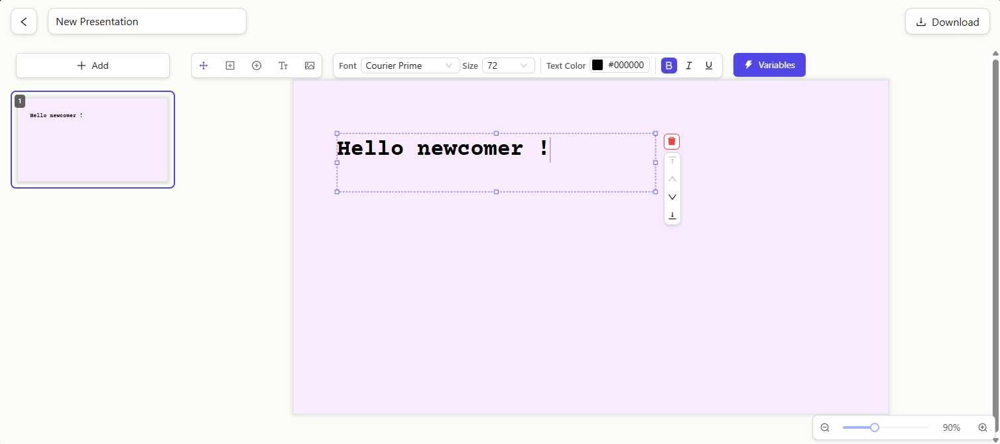
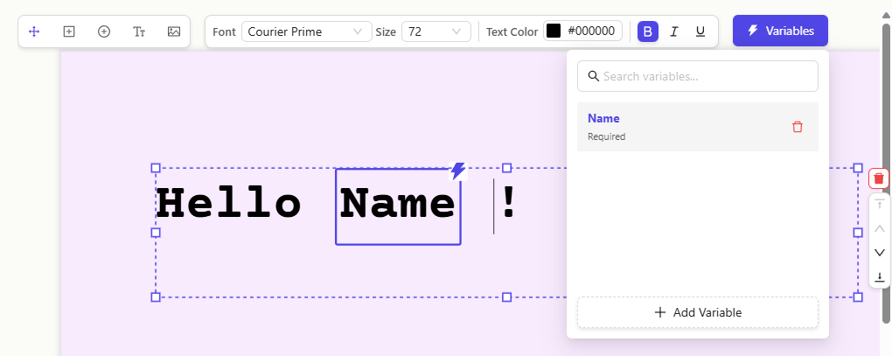
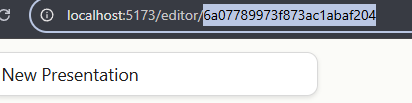
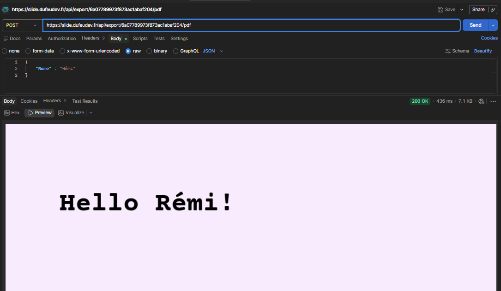
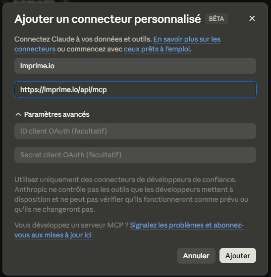

# What is this project

> Demo: [https://imprime.io/](https://imprime.io/)

Imprime is a tool that speeds up document generation. It allows you to design templates in a visual editor by placing placeholders within them, and then generate the final documents either via the download button or via an API.

Designed primarily for developers, Imprime integrates as a dedicated component within your architecture, to which you can fully delegate the templating and document generation processes.

# Why Imprime

This project arose from a developer’s frustration: generating documents programmatically remains a tedious task, one that is poorly supported by existing tools such as DOCX markup or HTML templates.

# Can i use Imprime

The Apache 2.0 licence legally gives you the right to do pretty much anything you like with Imprime — including redistributing it commercially. We simply ask, in all friendship, that you do not take Imprime as it is and resell it as your own product or service. The licence allows it, but we would appreciate it if you didn’t.

If Imprime is useful to you, the best way to support the project is to use it, share it, contribute, or simply use the futur official SaaS version.

# Features

## A full-featured document editor
At its core, Imprime is a powerful document editor. It ships with everything you'd expect from a modern editing experience: rich text formatting, shapes, images, groups with auto-layout, copy / paste / duplicate shortcuts, and more — all in an intuitive visual interface.


## Dynamic variables
Turn any document into a reusable template. Drop variables anywhere in your design, then generate finished documents on demand by injecting the data of your choice — perfect for invoices, contracts, reports, and any document you produce more than once.

Go further with **conditional** blocks (`if`) that only show a section when a boolean is true, and **iteration** blocks (`for`) that repeat their content for each item of a list — lists can be nested to build tables and sub-lists.


## Built for automation
Imprime is designed from the ground up for developers. Build your template once, then programmatically generate polished, data-driven documents at scale — through a clean REST API or directly from your AI agents via MCP.

### API
To print a presentation, you only need its ID. The easiest way to grab it is straight from the presentation's URL.



Then fire a POST request to the endpoint below, with a JSON body matching your presentation's variables — and get back a ready-to-ship PDF.
```
https://imprime.io/api/export/{{presentationId}}/pdf
```

Authenticate the call by passing an API key generated from **Settings → API Keys** in the `x-api-key` header.



### MCP
Imprime exposes an MCP server at `https://imprime.io/api/mcp` (Streamable HTTP transport). Two authentication modes are supported depending on the client:

- **OAuth 2.1 (Bearer token)** — for interactive clients like the Claude web connector. Add a custom connector pointing at `https://imprime.io/api/mcp`; the OAuth flow (discovery, login, consent, token exchange) is handled automatically by Better Auth's MCP plugin.
- **API key** — for headless clients like Claude Code, Claude Desktop, the Imprime SDK, or any script. Pass your key in the `x-api-key` header:

```json
{
  "mcpServers": {
    "imprime": {
      "type": "http",
      "url": "https://imprime.io/api/mcp",
      "headers": { "x-api-key": "<your-api-key>" }
    }
  }
}
```

Both paths land on the same server and expose the same tools — plug Imprime into your AI agents or chat interfaces and let them generate PDFs on your behalf.



## Sign-in and access control
Sign in with an email and a password, or with Google, GitHub or Microsoft. The administrator sets everything up from the app — SMTP server, single sign-on providers, who may sign in and from which domains — and a single `ADMIN_EMAIL` in the environment is all it takes to get started. See [Authentication and access](./doc/authentication.md).

# Roadmap

Imprime is currently under active development. Here are the main planned updates:

## Block enhancements
- *image variable
- condition on slide (if and for)

## Layout
- Margin
- Improve flex systeme (child flex 1)
- rethink the layout part
- guide lines

## Editor usability
- Multiple block selection and grouped operations

## Document format
- Change the resolution
- Add text document format in addition to current presentation format
- Add default style (font and bg color)
- Add pagination

## Automation
- MCP edition
- test API

---

This roadmap is indicative and will evolve based on user feedback. Please feel free to open an *issue* to suggest features or vote for the ones that interest you most.
